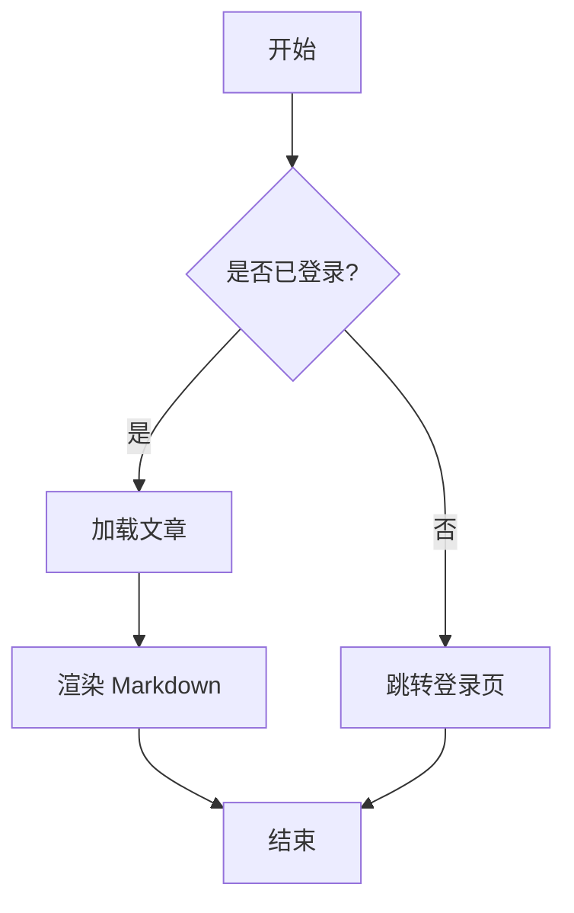
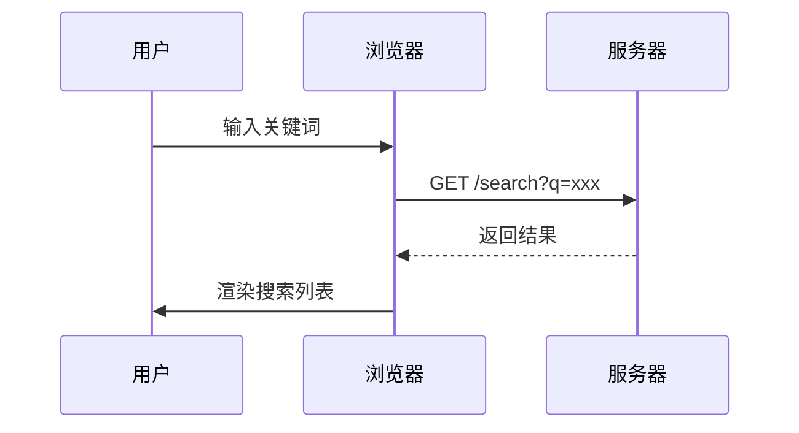
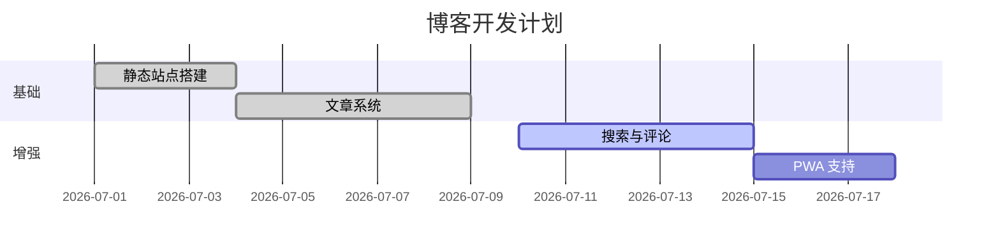

这是一篇用于验证 KaTeX 与 Mermaid 渲染的临时文章，验证后会删除。

## 行内公式

质能方程 $E = mc^2$ 是物理学最著名的公式。欧拉公式 $e^{i\pi} + 1 = 0$ 被称为「最美丽的数学公式」。

## 块级公式

$$
\int_{-\infty}^{\infty} e^{-x^2} \, dx = \sqrt{\pi}
$$

$$
\frac{\partial u}{\partial t} = \alpha \nabla^2 u
$$

## 流程图



## 时序图



## 甘特图



## 普通代码块不受影响

```js
const greeting = (name) => `Hello, ${name}!`;
console.log(greeting('world'));
```
